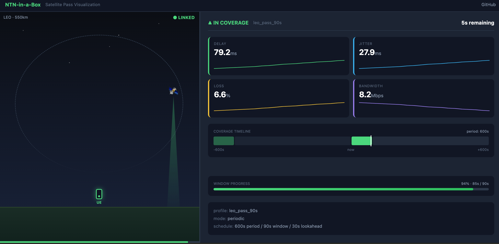

# NTN-in-a-Box

A self-hostable, open-source platform that makes any network path behave
like a Non-Terrestrial Network (NTN) — and exposes the satellite
capabilities (coverage windows, store-and-forward messaging, reachability)
that operators currently keep closed. Built so both real phones and
pure-software apps can develop and test against realistic NTN conditions
without any telecom hardware.

## Why

Android already ships `SatelliteManager` and a `TRANSPORT_SATELLITE`
network type, and operators are rolling out direct-to-cell messaging and
emergency services over satellite. But apps can't be built or tested
against this: Starlink Direct-to-Cell and operator sandboxes are gated
behind commercial roaming agreements, and existing open tools
(Sionna, OpenNTN, OpenAirInterface) target the PHY/RAN layers, not the
service/API/sandbox layer developers actually need.

NTN-in-a-Box fills that gap: a condition engine that shapes real network
traffic like a satellite pass (delay, jitter, loss, bandwidth, coverage
windows), plus a pluggable module system for building capabilities like
messaging/emergency and a CAMARA-aligned service API on top of it.

## Quick start

### Run any command under simulated NTN conditions (Linux)

```bash
go build -o ntnbox ./cmd/ntnbox/
go build -o poller ./cmd/poller/

# Run the reference poller under a simulated LEO pass (requires root)
sudo ./ntnbox run --profile testdata/profiles/leo_pass_90s.yaml -- ./poller
```

Output shows real degradation as the satellite pass progresses:

```
ntnbox: creating network namespace ntnbox-sandbox-0
ntnbox: [2026-07-07T10:00:00Z] window_opened
poller: polling http://localhost:8080/echo every 2s (timeout 5s)
timestamp | status | latency | result
2026-07-07T10:00:01Z | 200 |   152ms | ok      ← ramp-up (satellite rising)
2026-07-07T10:00:03Z | 200 |    43ms | ok      ← steady state (overhead)
...
2026-07-07T10:01:30Z |   0 |       — | timeout ← coverage lost (satellite set)
...
2026-07-07T10:10:00Z | 200 |   155ms | ok      ← next pass begins
```

Run your own app instead of `./poller`:

```bash
sudo ./ntnbox run --profile testdata/profiles/d2c_burst.yaml -- ./my-app
```

### macOS (via Docker)

On macOS, `ntnbox run` auto-detects the platform and transparently
re-invokes itself inside a Docker container:

```bash
make docker

# Run curl under NTN shaping
./ntnbox run --profile testdata/profiles/leo_pass_90s.yaml -- curl -o /dev/null -w "time_total: %{time_total}s\n" http://example.com

# Run the reference poller against an external URL
./ntnbox run --profile testdata/profiles/leo_pass_90s.yaml -- poller --url http://example.com --interval 2s
```

Requires Docker Desktop installed and running. Bare command names
(`curl`, `poller`) resolve from the container's PATH; local binaries
(prefixed with `./`) are bind-mounted into the container automatically.

### Demo script

A convenience script that builds everything, runs a demo, and cleans up:

```bash
./scripts/demo.sh                              # default: LEO pass + poller
./scripts/demo.sh --tui                        # with live TUI dashboard
./scripts/demo.sh --sample curl-demo           # curl polling demo
./scripts/demo.sh --sample go-messenger        # Go messenger with queue/flush
./scripts/demo.sh --tui --sample go-messenger  # TUI + sample
./scripts/demo.sh geo_steady                   # different profile
./scripts/demo.sh d2c_burst curl https://example.com  # custom command
PRUNE=1 ./scripts/demo.sh                     # also remove docker image on exit
```

The GUI is always available at `http://localhost:8080/ui` when using
the demo script.

### TUI Dashboard


Add `--tui` to get a live terminal dashboard instead of scrolling logs:

```bash
sudo ./ntnbox run --tui --profile testdata/profiles/leo_pass_90s.yaml -- ./poller
```

The dashboard shows:
- **Left panel:** coverage status (▲/▼), colored progress bar, link
  metrics with sparklines, profile info
- **Right panel:** scrollable output from the wrapped command, with
  coverage transition markers injected inline

Keyboard controls:
- `q` / `Ctrl+C` — quit
- `↑`/`↓`/`PgUp`/`PgDn` — scroll output
- `f` — toggle follow mode (auto-scroll)
- `Tab` — toggle expanded output view

The TUI auto-degrades to a stacked layout on terminals narrower than
100 columns. Without `--tui`, output behaves exactly as before
(scrolling logs, suitable for CI/piping).

### GUI Visualization



When running with `--addr`, a web-based GUI is available that shows a
live satellite pass animation:

```bash
sudo ./ntnbox run --addr :8080 --profile testdata/profiles/leo_pass_90s.yaml -- ./poller

# Open in browser:
# http://localhost:8080/ui
```

The GUI shows:
- **Left panel:** animated satellite moving along an orbit arc, coverage
  beam connecting to a ground device, sky darkening on coverage loss
- **Right panel:** live link metrics with sparklines, coverage timeline,
  window progress bar, and profile details (name, mode, schedule)

Features:
- Real-time updates via Server-Sent Events (no polling)
- Idle overlay when no session is active
- Responsive: stacks on narrow screens, hides animation on very narrow
- Works alongside `--tui` — open the GUI in a browser while TUI runs
  in the terminal

The GUI is embedded in the binary — no separate server or files needed.

### Query the kernel API (any platform)

```bash
./ntnbox serve --profile testdata/profiles/leo_pass_90s.yaml

# Register a virtual UE device
curl -X POST http://localhost:8080/devices \
  -H "Content-Type: application/json" \
  -d '{"id":"ue-1","type":"virtual_ue","profile_name":"leo_pass_90s"}'

# Query its current NTN condition
curl http://localhost:8080/devices/ue-1/condition
# {"in_coverage":true,"elapsed_sec":2.3,"until_next_transition_sec":87.7,
#  "delay_ms":135.6,"jitter_ms":28.3,"loss_pct":7.1,"bandwidth_kbps":4400}
```

## Sample applications

Ready-to-run examples in multiple languages showing how apps behave
under NTN conditions:

| Sample | Language | Pattern |
|--------|----------|---------|
| `samples/curl-demo.sh` | Shell | Simple polling — see latency and timeouts |
| `samples/node-retry/` | Node.js | Exponential backoff + offline queue |
| `samples/python-adaptive/` | Python | Latency-based state detection + store-and-forward |
| `samples/go-messenger/` | Go | Client/server messaging with queue flush |

```bash
# Via demo script (builds Docker, easiest on macOS):
./scripts/demo.sh --sample curl-demo
./scripts/demo.sh --sample go-messenger

# Direct (Linux native):
ntnbox run --profile testdata/profiles/leo_pass_90s.yaml -- ./samples/curl-demo.sh
ntnbox run --profile testdata/profiles/leo_pass_90s.yaml -- node samples/node-retry/index.js
ntnbox run --profile testdata/profiles/leo_pass_90s.yaml -- python3 samples/python-adaptive/client.py
```

The Docker image includes only Go binaries (ntnbox + poller) and curl.
Node.js and Python samples require their runtimes on the host (Linux
native). Shell and Go samples work on macOS via the Docker proxy
(cross-compiled and bind-mounted automatically).

No code changes needed in your app — ntnbox shapes the network
transparently at the OS level. See [TUTORIAL.md](TUTORIAL.md) for a
step-by-step walkthrough.

## Architecture

One platform, three capabilities, on a shared kernel:

```
Dev Sandbox          Messaging/SOS         Service API (CAMARA-aligned)
CLI · virtual UE       store-and-forward     REST endpoints
        \                    |                    /
         \                   |                   /
          --------- module contract (5 hooks) ---
                             |
              Platform Kernel (build once)
   Condition Engine · Device registry · IMS Adapter
   Event bus · Driver loop · API host
```

### Kernel components

| Package | Responsibility |
|---|---|
| `profile` | Parses and validates YAML pass-shape profiles (schedule + piecewise-linear impairment curves) |
| `condition` | Given a profile + epoch, computes coverage state and interpolated link impairments at any instant |
| `driver` | Ticks every 250ms, evaluates the Condition Engine, publishes coverage events and link state to the bus |
| `eventbus` | In-process pub/sub with throttled link-state (>5% delta or 250ms heartbeat) and unthrottled coverage events |
| `device` | In-memory registry of virtual UEs and real-phone stubs, each associated with a profile |
| `imsadapter` | Pluggable message delivery backend (mock with failure injection; real IMS later) |
| `apihost` | HTTP server: health, profiles, devices, condition state, echo |

### Dev Sandbox module

| Component | Responsibility |
|---|---|
| `devsandbox` | Module implementing the 5-hook contract; receives events, drives the netem shim |
| `netem` | Translates link-state values into `tc qdisc change` commands inside a network namespace |
| `netns` | Creates/destroys Linux network namespaces with veth pairs and NAT routing |

### Data flow

```
profile.yaml → profile.LoadFile() → Profile (static)
                                        │
                      condition.NewEvaluator(profile, epoch)
                                        │
                                        ▼
                                    Evaluator
                                        │
               driver.Loop ticks 250ms, calls Evaluate(now)
                                        │
                         ┌──────────────┴──────────────┐
                         ▼                              ▼
              CoverageEvent                      LinkState
           (transitions + lookahead)         (while in coverage)
                         │                              │
                         ▼                              ▼
                    eventbus.Bus ──────────────────────────
                         │
            ┌────────────┼────────────┐
            ▼            ▼            ▼
      Dev Sandbox    Messaging    Service API
      (netem/tc)     (future)      (future)
```

### Module contract

Every capability module plugs into the kernel through 5 hooks:

1. `RegisterRoutes(host)` — add HTTP endpoints
2. `OnCoverageEvent(event)` — react to coverage transitions + lookahead
3. `OnLinkState(state)` — react to link impairment changes
4. `DeliverVia(adapter)` — optionally deliver messages via IMS backend
5. `Emit(emitter)` — push observability events

### Pass-shape profiles

Profiles define how a satellite pass looks at the service layer:

```yaml
name: leo_pass_90s
schedule:
  mode: periodic          # periodic (LEO) or continuous (GEO)
  period_sec: 600         # full cycle length
  window_sec: 90          # coverage window duration
  lookahead_sec: 30       # advance notice before transitions
curves:
  delay_ms:
    - { offset_sec: 0, value: 150 }    # horizon (high delay)
    - { offset_sec: 15, value: 40 }    # overhead (low delay)
    - { offset_sec: 75, value: 40 }
    - { offset_sec: 90, value: 100 }   # setting
  # jitter_ms, loss_pct, bandwidth_kbps follow the same shape
```

Sample profiles included: `leo_pass_90s`, `geo_steady`, `d2c_burst`.

### Out-of-coverage behavior

When a coverage window closes, the Dev Sandbox sets 100% packet loss —
packets silently drop, mimicking real satellite behavior (the signal
disappears without sending ICMP unreachable or RST). Apps must detect
outages via timeouts, which is exactly what NTN-aware apps need to handle.

## API reference

| Method | Path | Description |
|---|---|---|
| GET | `/health` | Liveness check |
| GET | `/echo` | Returns `{"ts":"..."}` (poller target) |
| GET | `/profiles` | List loaded profiles |
| GET | `/profiles/{name}` | Get a profile's full definition |
| POST | `/devices` | Register a device (`{id, type, profile_name}`) |
| GET | `/devices` | List registered devices |
| GET | `/devices/{id}` | Get a device |
| GET | `/devices/{id}/condition` | Current coverage + link state |
| GET | `/devices/{id}/capabilities` | Satellite capability discovery |
| GET | `/sandbox/status` | Current shaping values (Dev Sandbox) |
| GET | `/events` | SSE stream of real-time coverage + link-state events |
| GET | `/ui/` | Web GUI (satellite pass visualization) |

## Development

Requires Go 1.26+.

```
make build   # go build ./...
make test    # go test ./...
make fmt     # gofmt + goimports, applied in place
make vet     # go vet ./...
make lint    # golangci-lint run ./...  (see .golangci.yml)
make check   # fmt + vet + lint + test + build — run before committing
make docker  # build Docker image (ntnbox:latest)
```

`golangci-lint` and `goimports` aren't part of the standard Go toolchain;
install them once with:

```
go install github.com/golangci/golangci-lint/v2/cmd/golangci-lint@latest
go install golang.org/x/tools/cmd/goimports@latest
```

## License

[Apache License 2.0](LICENSE)
