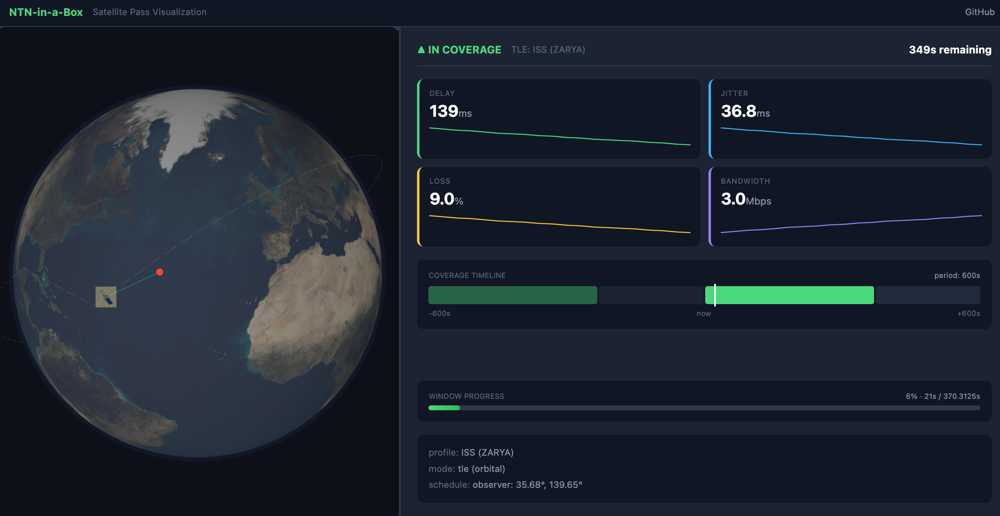
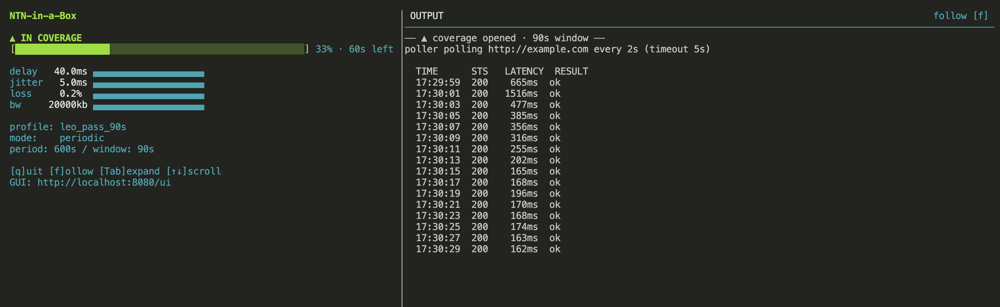

# NTN-in-a-Box

[](https://github.com/hyavari/ntn-in-a-box/releases)
[](LICENSE)
[](go.mod)
[](https://github.com/hyavari/ntn-in-a-box/pkgs/container/ntn-in-a-box)

Shape any path like a satellite pass — LEO windows, GEO blockages, real
`tc`/`netem`.



A self-hostable, open-source platform that makes any network path behave
like a Non-Terrestrial Network (NTN) — and exposes the satellite
capabilities (coverage windows, store-and-forward messaging, reachability)
that operators currently keep closed. Built so both real phones and
pure-software apps can develop and test against realistic NTN conditions
without any telecom hardware.

## Why

Android already ships `SatelliteManager` and a `TRANSPORT_SATELLITE`
network type, and operators are rolling out direct-to-cell messaging and
emergency services over satellite. But apps can't be built or tested
against this: Starlink Direct-to-Cell and operator sandboxes are gated
behind commercial roaming agreements, and existing open tools
(Sionna, OpenNTN, OpenAirInterface) target the PHY/RAN layers, not the
service/API/sandbox layer developers actually need.

NTN-in-a-Box fills that gap: a condition engine that shapes real network
traffic like a satellite pass (delay, jitter, loss, bandwidth, coverage
windows), plus a pluggable module system for building capabilities like
messaging/emergency and a CAMARA-aligned service API on top of it.

## Quick start

### Run any command under simulated NTN conditions (Linux)

```bash
go build -o ntnbox ./cmd/ntnbox/
go build -o poller ./cmd/poller/

# Run the reference poller under a simulated LEO pass (requires root)
sudo ./ntnbox run --profile testdata/profiles/leo_pass_90s.yaml -- ./poller
```

Output shows real degradation as the satellite pass progresses:

```
ntnbox: creating network namespace ntnbox-sandbox-0
ntnbox: [2026-07-07T10:00:00Z] window_opened
poller: polling http://localhost:8080/echo every 2s (timeout 5s)
timestamp | status | latency | result
2026-07-07T10:00:01Z | 200 |   152ms | ok      ← ramp-up (satellite rising)
2026-07-07T10:00:03Z | 200 |    43ms | ok      ← steady state (overhead)
...
2026-07-07T10:01:30Z |   0 |       — | timeout ← coverage lost (satellite set)
...
2026-07-07T10:10:00Z | 200 |   155ms | ok      ← next pass begins
```

Run your own app instead of `./poller`:

```bash
sudo ./ntnbox run --profile testdata/profiles/d2c_burst.yaml -- ./my-app
```

### macOS (via Docker)

On macOS, `ntnbox run` auto-detects the platform and transparently
re-invokes itself inside a Docker container. Prefer a published image:

```bash
# Public image — no docker login required
docker pull ghcr.io/hyavari/ntn-in-a-box:latest
docker tag ghcr.io/hyavari/ntn-in-a-box:latest ntnbox:latest
# or build locally: make docker
```

```bash
# Run curl under NTN shaping
./ntnbox run --profile testdata/profiles/leo_pass_90s.yaml -- curl -o /dev/null -w "time_total: %{time_total}s\n" http://example.com

# Run the reference poller against an external URL
./ntnbox run --profile testdata/profiles/leo_pass_90s.yaml -- poller --url http://example.com --interval 2s
```

Requires Docker Desktop installed and running. Bare command names
(`curl`, `poller`) resolve from the container's PATH; local binaries
(prefixed with `./`) are bind-mounted into the container automatically.

### Demo, TUI, and GUI

```bash
./scripts/demo.sh --tui    # builds, runs LEO + poller, opens GUI at :8080/ui
```

Field-data JSON at session end:

```bash
sudo ./ntnbox run --report out.json --profile testdata/profiles/leo_pass_90s.yaml -- ./poller
```

Field meanings: [Report](guides/report.md).

More demos (record/replay, samples, SOS profiles): [Getting started](guides/getting-started.md).
Continuous GEO with surprise tunnel drops: `./scripts/demo-blockage.sh`
([Profiles](guides/profiles.md)).




### TLE (real satellite orbits)

```bash
sudo ./ntnbox run \
  --tle testdata/tle/iss.tle \
  --lat 37.7749 --lon -122.4194 \
  --start-at next-pass --speed 10 \
  -- ./poller
```

Flags, link models, and `demo-tle.sh`: [TLE guide](guides/tle.md).

### Query the kernel API (any platform)

```bash
./ntnbox serve --profile testdata/profiles/leo_pass_90s.yaml
curl http://localhost:8080/devices/sandbox-0/condition
```

Full endpoints and `serve` modes: [API reference](guides/api.md).
Adaptation patterns: [COOKBOOK.md](COOKBOOK.md).

### GitHub Action

```yaml
- uses: hyavari/ntn-in-a-box@v1
  with:
    profile: leo_pass_90s
    command: npm test
```

Inputs, replay/record examples: [Getting started](guides/getting-started.md#github-action).

## Documentation

| Doc | Use when |
|-----|----------|
| [Getting started](guides/getting-started.md) | Demos, TUI/GUI detail, samples, Action, Android |
| [Profiles](guides/profiles.md) | YAML schema, blockages, out-of-coverage |
| [Report](guides/report.md) | `--report` JSON field-data summary |
| [TLE](guides/tle.md) | Orbital TLE generate/run |
| [Architecture](guides/architecture.md) | Kernel, modules, data flow |
| [API](guides/api.md) | HTTP endpoints |
| [TUTORIAL.md](TUTORIAL.md) | Step-by-step walkthrough |
| [COOKBOOK.md](COOKBOOK.md) | Queue flush, burst gates, store-and-forward |

## Development

Requires Go 1.26+.

```
make hooks   # once per clone: enable .githooks (pre-commit runs check-fmt + lint)
make build   # go build ./...
make test    # go test ./...
make fmt     # gofmt + goimports, applied in place
make vet     # go vet ./...
make lint    # golangci-lint run ./...  (see .golangci.yml)
make check   # fmt + vet + lint + test + build — run before committing
make docker  # build local image (ntnbox:latest); releases also push ghcr.io/hyavari/ntn-in-a-box
make assert-demo  # optional: ntnbox assert (serve + UE→cloud delivered smoke)
```

`golangci-lint` and `goimports` aren't part of the standard Go toolchain;
install them once with:

```
go install github.com/golangci/golangci-lint/v2/cmd/golangci-lint@latest
go install golang.org/x/tools/cmd/goimports@latest
```

### Release

Tag and push — that alone publishes GitHub Release binaries, GHCR
(`:vX.Y.Z` + `:latest`), and embeds the tag in `ntnbox version`. No README
or smoke-workflow version bumps.

```
git tag v0.1.4
git push origin v0.1.4
```

## License

[Apache License 2.0](LICENSE)
